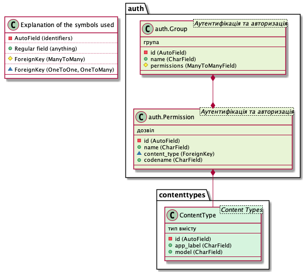

===================
Plant UML generator
===================

.. image:: https://img.shields.io/pypi/l/django-model2puml
.. image:: https://img.shields.io/github/v/tag/sen-den/django-model2puml
.. image:: https://img.shields.io/github/last-commit/sen-den/django-model2puml
.. image:: https://img.shields.io/github/commit-activity/m/sen-den/django-model2puml
.. image:: https://img.shields.io/pypi/dm/django-model2puml

django-model2puml app is a generator of project models structure in
PlantUML class notation.

Quick start
-----------

1. Add "uml_generator" to your INSTALLED_APPS setting like this::

    INSTALLED_APPS = [
        ...
        'puml_generator',
    ]

2. Run django management command ``generate_puml`` like this ``./manage.py generate_puml``

Params::

    --file - output file
    --title - provide a title for diagram
    --add-help - to add docstrings to diagram
    --add-choices - to add Choices description of fields to diagram
    --add-legend - to include explanation of the symbols used
    --add-omitted-headers - for omitted foreign app a header stub should be presented
    --omit - specify apps to be omitted in diagram
    --include - specify apps to be included in diagram; other will be omitted
    --headers-only - use only model header and relations, omit fields list

3. Check generated PlantUML file!

``./manage.py generate_puml --file diagram.puml --include auth contenttypes --add-help --add-legend``

Release notes
-------------

2021-03-15 v0.1.14
..................

- ImportError in utils.py
